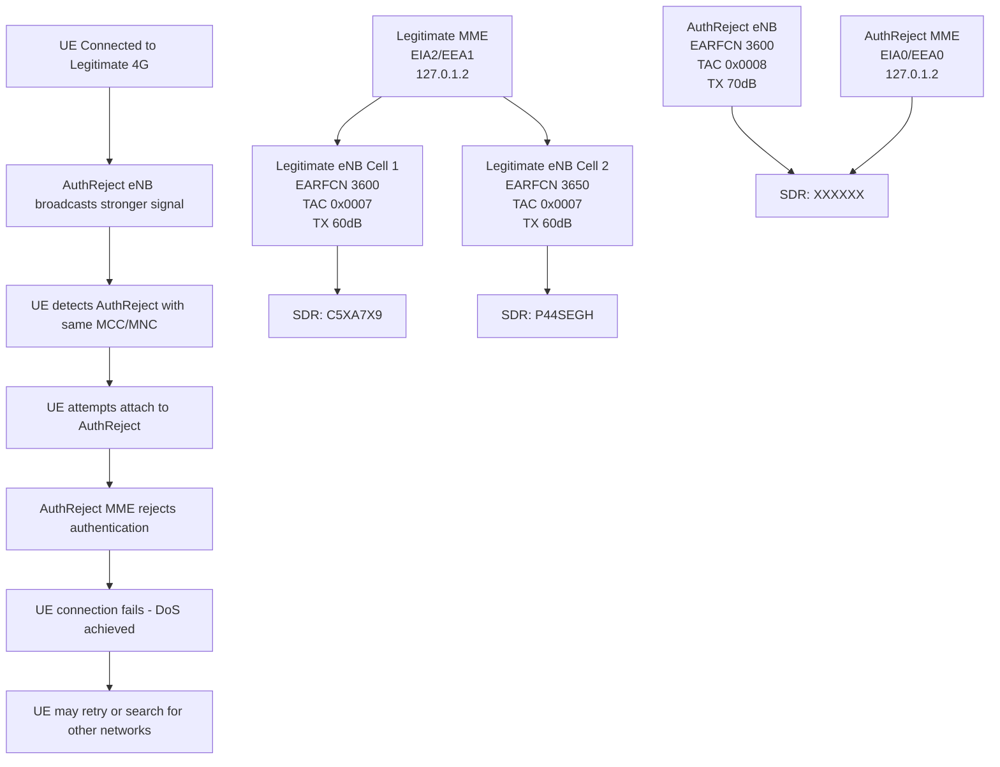
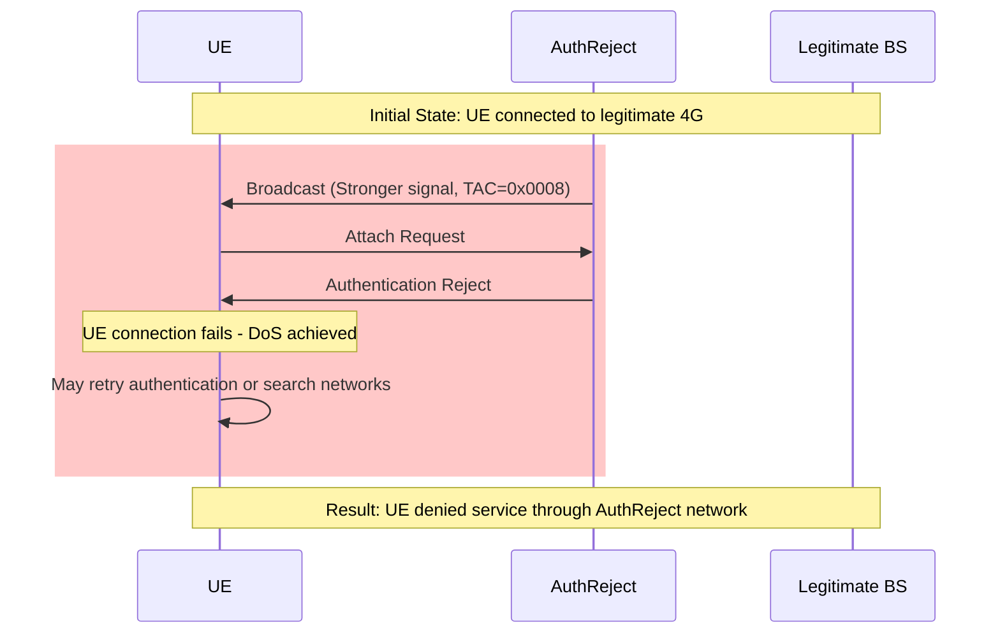

# AuthReject Attack Setup

## Overview

This configuration implements an Authentication Rejection (AuthReject) attack designed to create a denial of service by forcing User Equipment (UE) authentication failures. The attack leverages signal overpowering and protocol manipulation to demonstrate LTE authentication vulnerabilities.

## Architecture



## Attack Mechanism

### Phase 1: Signal Overpowering
1. **AuthReject eNB broadcasts** with +10 dB stronger signal than legitimate eNB
2. **UE detects AuthReject** with identical MCC/MNC (appears as same operator)
3. **UE initiates** authentication procedure due to TAC mismatch (0x0008 vs 0x0007)

### Phase 2: Authentication Rejection
4. **AuthReject MME rejects** all authentication requests
5. **UE connection fails** causing denial of service
6. **UE may retry** or search for alternative networks

### Phase 3: DoS Impact
7. **Service disruption**: UE cannot establish connection through AuthReject network
8. **Repeated failures**: UE may experience prolonged connection issues
9. **Network confusion**: UE struggles to distinguish between legitimate and attack networks

## Configuration Parameters

### Copied from Legitimate
- **MCC/MNC**: 001/01 (appears as same operator)
- **EARFCN**: 3600 (targets same frequency band)
- **Bandwidth**: 50 PRB (compatible with legitimate)

### Modified for Attack
- **TAC**: 0x0008 (8) triggers authentication procedure
- **TX Gain**: 70 dB (+10 dB stronger than legitimate 60 dB)
- **Security**: EIA0/EEA0 (disabled integrity/encryption)
- **Cell ID**: 0x03 (different from legitimate 0x01)
- **PCI**: 4 (unused by legitimate cells)
- **Handover**: Disabled (standalone operation)
- **Attach/Auth Rejection**: Enabled (rejects all requests)

## Setup Instructions

### Prerequisites
- Three USRP B210/B220 SDR devices
- srsRAN 4G and Open5GS installed
- Shielded environment for testing

### 1. SDR Configuration
```bash
# Verify SDR devices are connected
uhd_find_devices

# Expected output:
# Device 1: serial=C5XA7X9 (Legitimate Cell 1)
# Device 2: serial=P44SEGH (Legitimate Cell 2)
# Device 3: serial=XXXXXX (AuthReject Base Station)
```

### 2. Copy Configurations
```bash
# Copy AuthReject configurations to srsRAN config directory
sudo cp configs/authreject_enb.conf /root/.config/srsran/
sudo cp configs/authreject_sib.conf /root/.config/srsran/
sudo cp configs/authreject_rr.conf /root/.config/srsran/
sudo cp configs/authreject_rb.conf /root/.config/srsran/

# Copy AuthReject MME configuration (overwrites legitimate MME config when running attack)
sudo cp configs/authreject_mme.yaml /etc/open5gs/mme.yaml
```

### 3. Configure HSS Database (Critical for Authentication Rejection)
```bash
# IMPORTANT: Ensure HSS database has NO valid subscribers for the attack network
# This causes the MME to reject all authentication attempts with "IMSI unknown in HSS"

# Option 1: Remove specific IMSI from HSS
sudo open5gs-dbctl remove <IMSI_of_target_UE>

# Option 2: Verify HSS has no subscribers (recommended for isolated attack network)
sudo open5gs-dbctl list
# Should show empty or only legitimate network subscribers

# Note: Without valid subscribers in HSS, all UE attach attempts will be rejected
```

### 4. Start AuthReject Components

#### Terminal 1: Start AuthReject MME
```bash
sudo open5gs-mmed -c /etc/open5gs/mme.yaml
```

#### Terminal 2: Start AuthReject eNB
```bash
sudo srsenb /root/.config/srsran/authreject_enb.conf
```

### 5. Monitor Attack
```bash
# Monitor AuthReject eNB logs
tail -f /tmp/authreject_enb.log

# Monitor AuthReject MME logs (look for "IMSI unknown" rejection messages)
tail -f /var/log/open5gs/mme.log

# Expected behavior:
# - UE detects AuthReject cell (stronger signal, TAC 0x0008)
# - UE attempts attach due to TAC mismatch
# - MME rejects with "IMSI unknown in HSS" or similar error
# - UE denied service (DoS achieved)
```

## Parameter Adjustment Template

### If your legitimate setup differs:

| Parameter | Your Legitimate Value | AuthReject Formula |
|-----------|----------------------|-------------------|
| MCC | [your_mcc] | SAME |
| MNC | [your_mnc] | SAME |
| TAC | [your_tac] | DIFFERENT (e.g., [your_tac] + 1) |
| EARFCN | [your_earfcn] | SAME |
| TX Gain | [your_tx_gain] | [your_tx_gain] + 10 |
| Cell ID | [your_cell_id] | DIFFERENT |
| PCI | [your_pci] | UNUSED VALUE |

## Attack Flow Diagram



## Troubleshooting

### UE doesn't connect to AuthReject:
- **Increase TX gain** by 5 dB increments until UE attaches
- **Verify MCC/MNC** matches legitimate network exactly
- **Check EARFCN** is correct for your region
- **Ensure SDR #3** is properly connected

### MME fails to start:
- **Check port conflicts** (36412 may be in use by legitimate MME)
- **Ensure legitimate network is stopped** (attacks run sequentially)
- **Check FreeDiameter** configuration matches MME config

### Authentication not rejected:
- **Verify TAC difference** (AuthReject must use different TAC: 0x0008 vs 0x0007)
- **Check HSS database** is empty or target IMSI is removed (critical!)
- **Monitor MME logs** for "IMSI unknown in HSS" rejection messages
- **Verify UE IMSI** is NOT provisioned in HSS database
- Run `sudo open5gs-dbctl list` to verify no subscribers exist

### Poor signal quality:
- **Adjust TX gain** incrementally (start at +5 dB, increase to +15 dB if needed)
- **Check antenna positioning** (AuthReject antenna should be closer to UE)
- **Verify SDR calibration** (run UHD calibration if needed)

## Safety Considerations

### ⚠️ CRITICAL WARNINGS ⚠️

1. **Authorized Use Only**: This configuration is for educational security research
2. **Shielded Environment**: Always operate in Faraday cage or shielded room
3. **Legal Compliance**: Unauthorized operation violates telecommunications laws
4. **Power Control**: Monitor TX power to prevent interference with legitimate networks

### Emergency Stop
```bash
# Stop AuthReject eNB
sudo pkill -f srsenb

# Stop AuthReject MME (same as legitimate MME)
sudo pkill -f open5gs-mmed
```

## Files Structure

```
authreject-attack/
├── configs/
│   ├── authreject_enb.conf      # AuthReject eNB configuration (TX gain +10dB, TAC 0x0008)
│   ├── authreject_sib.conf      # System information (copied from legitimate)
│   ├── authreject_rr.conf       # Radio resources (PCI 4, Cell ID 0x03)
│   ├── authreject_rb.conf       # Radio bearers (copied from legitimate)
│   └── authreject_mme.yaml      # MME config (EIA0/EEA0, authentication rejection) - copies to /etc/open5gs/mme.yaml
├── docs/
│   ├── ANALYSIS.md              # Legitimate network parameter analysis
│   ├── PARAMETERS.md            # Parameter comparison and rationale
│   └── README.md                # This file
└── README.md                    # Quick start guide
```

## Technical References

- **3GPP TS 36.331**: LTE RRC specifications
- **3GPP TS 24.301**: LTE NAS specifications
- **3GPP TS 23.401**: LTE system architecture
- **srsRAN Documentation**: https://docs.srsran.com
- **Open5GS Documentation**: https://open5gs.org

## Research Applications

This setup demonstrates:
- LTE authentication vulnerabilities
- Denial of service attack techniques
- Signal overpowering techniques
- NAS protocol exploitation
- UE authentication failure scenarios

**For educational purposes only. Unauthorized deployment is illegal.**
