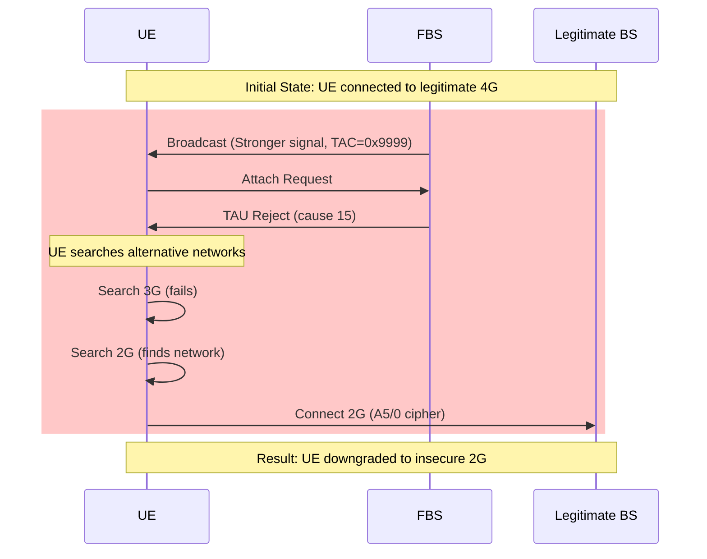

# FBS Downgrade Attack Setup

## Overview

This configuration implements a False Base Station (FBS) designed to force User Equipment (UE) downgrade from 4G LTE to 2G GSM networks through Tracking Area Update (TAU) rejection. The attack leverages signal overpowering and protocol manipulation to demonstrate LTE security vulnerabilities.

## Architecture

```mermaid
graph TD
    A[UE Connected to Legitimate 4G] --> B[FBS broadcasts stronger signal]
    B --> C[UE detects FBS with same MCC/MNC]
    C --> D[UE attempts attach to FBS]
    D --> E[FBS sends TAU Reject (cause 15)]
    E --> F[UE searches for 3G networks]
    F --> G[UE searches for 2G networks]
    G --> H[UE connects to 2G with weak cipher A5/0]

    I[Legitimate eNB Cell 1<br/>EARFCN 3600<br/>TAC 0x0007<br/>TX 60dB] --> J[SDR: C5XA7X9]
    K[Legitimate eNB Cell 2<br/>EARFCN 3650<br/>TAC 0x0007<br/>TX 60dB] --> L[SDR: P44SEGH]

    M[FBS eNB<br/>EARFCN 3600<br/>TAC 0x9999<br/>TX 75dB] --> N[SDR: VRFKZRP]
    O[FBS MME<br/>EIA0/EEA0<br/>127.0.1.100] --> N

    P[Legitimate MME<br/>EIA2/EEA1<br/>127.0.1.2] --> I
    P --> K
```

## Attack Mechanism

### Phase 1: Signal Overpowering
1. **FBS broadcasts** with +15 dB stronger signal than legitimate eNB
2. **UE detects FBS** with identical MCC/MNC (appears as same operator)
3. **UE initiates** Tracking Area Update due to TAC mismatch (0x9999 vs 0x0007)

### Phase 2: Protocol Exploitation
4. **FBS rejects TAU** with cause code 15 (no suitable cells in tracking area)
5. **UE searches** for alternative networks (3G → 2G fallback)
6. **UE connects** to 2G network with weak A5/0 cipher (no encryption)

### Phase 3: Security Degradation
7. **Encryption disabled**: EEA0 (null cipher) instead of EEA1/EEA2
8. **Integrity disabled**: EIA0 (null integrity) instead of EIA2/EIA1
9. **Fallback to 2G**: A5/0 cipher provides no security

## Configuration Parameters

### Copied from Legitimate
- **MCC/MNC**: 001/01 (appears as same operator)
- **EARFCN**: 3600 (targets same frequency band)
- **Bandwidth**: 50 PRB (compatible with legitimate)
- **System Information**: SIB structure maintained

### Modified for Attack
- **TAC**: 0x9999 (39321) triggers TAU procedure
- **TX Gain**: 75 dB (+15 dB stronger than legitimate 60 dB)
- **Security**: EIA0/EEA0 (disabled integrity/encryption)
- **Cell ID**: 0x02 (different from legitimate 0x01)
- **PCI**: 3 (unused by legitimate cells 1/2)
- **Handover**: Disabled (standalone operation)

## Setup Instructions

### Prerequisites
- Three USRP B210/B220 SDR devices
- srsRAN 4G and Open5GS installed
- Shielded environment for testing

### 1. SDR Configuration
```bash
# Verify SDR devices are connected
uhd_find_devices

# Expected output:
# Device 1: serial=C5XA7X9 (Legitimate Cell 1)
# Device 2: serial=P44SEGH (Legitimate Cell 2)
# Device 3: serial=VRFKZRP (False Base Station)
```

### 2. Copy Configurations
```bash
# Copy FBS configurations to srsRAN config directory
sudo cp configs/fbs_enb.conf /root/.config/srsran/
sudo cp configs/fbs_sib.conf /root/.config/srsran/
sudo cp configs/fbs_rr.conf /root/.config/srsran/
sudo cp configs/fbs_rb.conf /root/.config/srsran/

# Copy FBS MME configuration
sudo cp configs/fbs_mme.yaml /etc/open5gs/fbs_mme.yaml
```

### 3. Start FBS Components

#### Terminal 1: Start FBS MME
```bash
sudo open5gs-mmed -c /etc/open5gs/fbs_mme.yaml
```

#### Terminal 2: Start FBS eNB
```bash
sudo srsenb /root/.config/srsran/fbs_enb.conf
```

### 4. Monitor Attack
```bash
# Monitor FBS eNB logs
tail -f /tmp/fbs_enb.log

# Monitor FBS MME logs
tail -f /var/log/open5gs/fbs_mme.log
```

## Parameter Adjustment Template

### If your legitimate setup differs:

| Parameter | Your Legitimate Value | FBS Formula |
|-----------|----------------------|-------------|
| MCC | [your_mcc] | SAME |
| MNC | [your_mnc] | SAME |
| TAC | [your_tac] | 0x9999 |
| EARFCN | [your_earfcn] | SAME |
| TX Gain | [your_tx_gain] | [your_tx_gain] + 15 |
| Cell ID | [your_cell_id] | DIFFERENT |
| PCI | [your_pci] | UNUSED VALUE |

## Attack Flow Diagram



## Troubleshooting

### UE doesn't connect to FBS:
- **Increase TX gain** by 5 dB increments until UE attaches
- **Verify MCC/MNC** matches legitimate network exactly
- **Check EARFCN** is correct for your region
- **Ensure SDR #3** (VRFKZRP) is properly connected

### MME fails to start:
- **Check port conflicts** (36412 may be in use by legitimate MME)
- **Verify IP addresses** (127.0.1.100 range should be free)
- **Check FreeDiameter** configuration matches MME config

### No TAU procedure triggered:
- **Verify TAC difference** (FBS must use 0x9999, legitimate uses different)
- **Check UE 4G capability** (must support LTE)
- **Monitor UE logs** for TAU attempt messages

### Poor signal quality:
- **Adjust TX gain** incrementally (start at +10 dB, increase to +20 dB if needed)
- **Check antenna positioning** (FBS antenna should be closer to UE than legitimate)
- **Verify SDR calibration** (run UHD calibration if needed)

## Safety Considerations

### ⚠️ CRITICAL WARNINGS ⚠️

1. **Authorized Use Only**: This configuration is for educational security research
2. **Shielded Environment**: Always operate in Faraday cage or shielded room
3. **Legal Compliance**: Unauthorized operation violates telecommunications laws
4. **Power Control**: Monitor TX power to prevent interference with legitimate networks

### Emergency Stop
```bash
# Stop FBS eNB
sudo pkill -f srsenb

# Stop FBS MME
sudo pkill -f open5gs-mmed
```

## Files Structure

```
fbs-downgrade-attack/
├── configs/
│   ├── fbs_enb.conf      # FBS eNB configuration (TX gain +15dB, TAC 0x9999)
│   ├── fbs_sib.conf      # System information with attack TAC
│   ├── fbs_rr.conf       # Radio resources (PCI 3, Cell ID 0x02)
│   ├── fbs_rb.conf       # Radio bearers (copied from legitimate)
│   └── fbs_mme.yaml      # MME config (EIA0/EEA0, isolated network)
├── docs/
│   ├── ANALYSIS.md       # Legitimate network parameter analysis
│   ├── PARAMETERS.md     # Parameter comparison and rationale
│   └── README.md         # This file
└── README.md             # Quick start guide
```

## Technical References

- **3GPP TS 36.331**: LTE RRC specifications
- **3GPP TS 24.301**: LTE NAS specifications
- **3GPP TS 23.401**: LTE system architecture
- **srsRAN Documentation**: https://docs.srsran.com
- **Open5GS Documentation**: https://open5gs.org

## Research Applications

This setup demonstrates:
- LTE protocol vulnerabilities
- Tracking Area Update exploitation
- Signal overpowering techniques
- RAT fallback mechanisms
- 2G security weaknesses (A5/0 cipher)

**For educational purposes only. Unauthorized deployment is illegal.**
