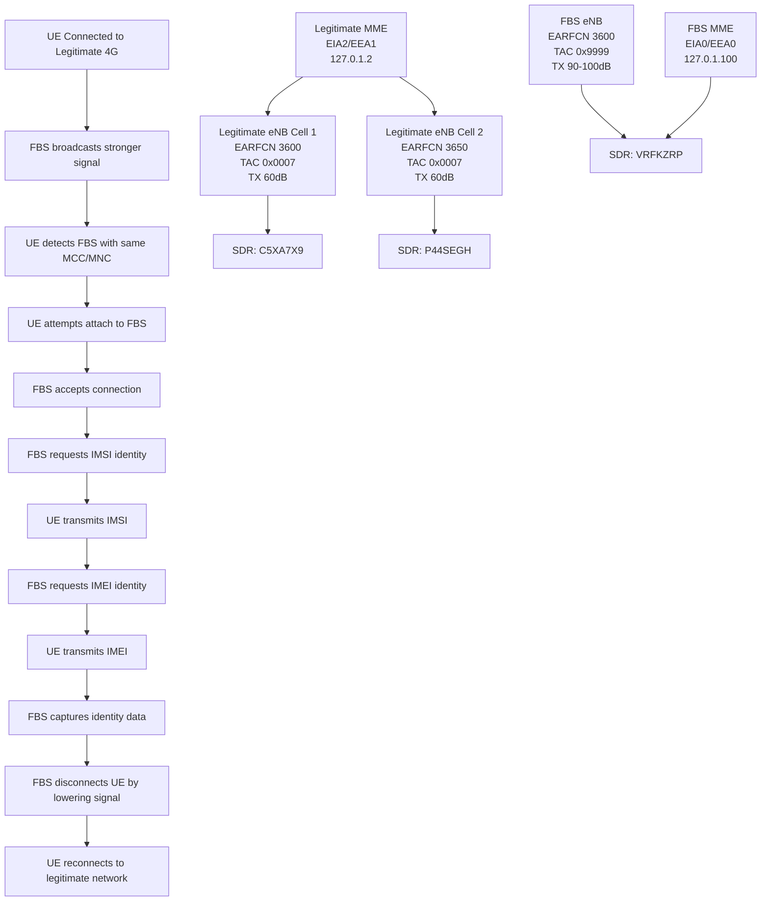
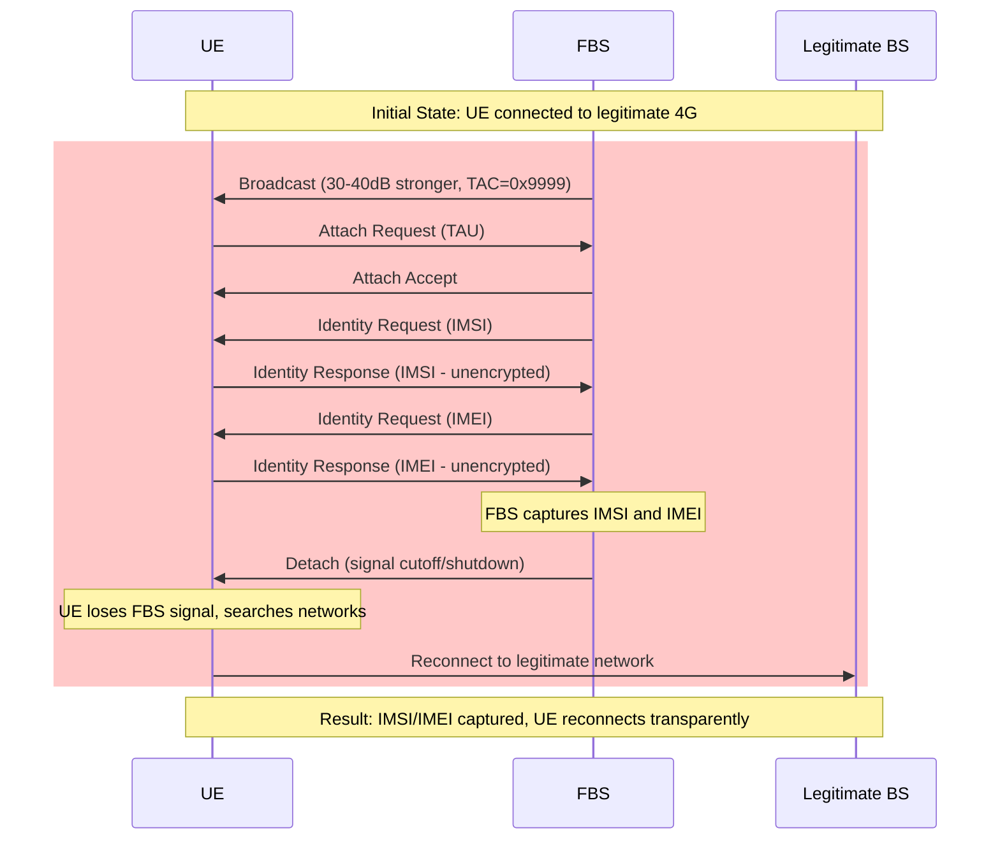

# IMSI Catching Attack Setup

## Overview

This configuration implements a False Base Station (FBS) designed to intercept mobile phone communications and capture International Mobile Subscriber Identity (IMSI) numbers through man-in-the-middle techniques. The FBS acts as a fake base station that lures nearby devices by broadcasting stronger signals with the same network identifiers, capturing identity information before disconnecting.

## Architecture



## Attack Mechanism

### Phase 1: Signal Overpowering
1. **FBS broadcasts** with +30-40 dB stronger signal than legitimate eNB (90-100dB total)
2. **UE detects FBS** with identical MCC/MNC (appears as same operator)
3. **UE initiates** Tracking Area Update due to TAC mismatch (0x9999 vs 0x0007)

### Phase 2: Identity Capture
4. **FBS accepts connection** and completes attach procedure
5. **FBS requests IMSI** identity from UE during authentication
6. **UE transmits IMSI** (unencrypted due to null ciphering)
7. **FBS requests IMEI** identity for device identification
8. **UE transmits IMEI** (unencrypted due to null ciphering)

### Phase 3: Connection Termination
9. **FBS captures** IMSI and IMEI identity information
10. **FBS disconnects UE** by lowering signal strength or shutting down
11. **UE reconnects** to legitimate network (transparent to user)

## Configuration Parameters

### Copied from Legitimate
- **MCC/MNC**: 001/01 (appears as same operator)
- **EARFCN**: 3600 (targets same frequency band)
- **Bandwidth**: 50 PRB (compatible with legitimate)
- **System Information**: SIB structure maintained

### Modified for Attack
- **TAC**: 0x9999 (39321) triggers TAU procedure for identity capture
- **TX Gain**: 60 dB (same as legitimate due to SDR capability limitations)
- **Security**: EIA0/EEA0 (disabled integrity/encryption to capture unencrypted IMSI/IMEI)
- **Cell ID**: 0x02 (different from legitimate 0x01 to avoid conflicts)
- **PCI**: 3 (unused by legitimate cells to avoid conflicts)
- **Handover**: Disabled (standalone operation for attack isolation)
- **Connection Timer**: 1000ms (quick disconnect after identity capture)

## Setup Instructions

### Prerequisites
- Three USRP B210/B220 SDR devices
- srsRAN 4G and Open5GS installed
- Shielded environment for testing

### 1. SDR Configuration
```bash
# Verify SDR devices are connected
uhd_find_devices

# Expected output:
# Device 1: serial=C5XA7X9 (Legitimate Cell 1)
# Device 2: serial=P44SEGH (Legitimate Cell 2)
# Device 3: serial=VRFKZRP (False Base Station)
```

### 2. Copy Configurations
```bash
# Copy FBS configurations to srsRAN config directory
sudo cp configs/fbs_enb.conf /root/.config/srsran/
sudo cp configs/fbs_sib.conf /root/.config/srsran/
sudo cp configs/fbs_rr.conf /root/.config/srsran/
sudo cp configs/fbs_rb.conf /root/.config/srsran/

# Copy FBS MME configuration
sudo cp configs/fbs_mme.yaml /etc/open5gs/fbs_mme.yaml
```

### 3. Start FBS Components

#### Terminal 1: Start FBS MME
```bash
sudo open5gs-mmed -c /etc/open5gs/fbs_mme.yaml
```

#### Terminal 2: Start FBS eNB
```bash
sudo srsenb /root/.config/srsran/fbs_enb.conf
```

### 4. Monitor Attack
```bash
# Monitor FBS eNB logs
tail -f /tmp/fbs_enb.log

# Monitor FBS MME logs
tail -f /var/log/open5gs/fbs_mme.log
```

## Parameter Adjustment Template

### If your legitimate setup differs:

| Parameter | Your Legitimate Value | FBS Formula |
|-----------|----------------------|-------------|
| MCC | [your_mcc] | SAME |
| MNC | [your_mnc] | SAME |
| TAC | [your_tac] | 0x9999 |
| EARFCN | [your_earfcn] | SAME |
| TX Gain | [your_tx_gain] | SAME (SDR limited to 80dB max) |
| Cell ID | [your_cell_id] | DIFFERENT |
| PCI | [your_pci] | UNUSED VALUE |
| Connection Timer | 30000ms (legitimate) | 1000ms (quick disconnect) |

## Attack Flow Diagram



## Troubleshooting

### UE doesn't connect to FBS:
- **Increase TX gain** to +40 dB (100 dB total) for maximum success rate
- **Verify MCC/MNC** matches legitimate network exactly
- **Check EARFCN** is correct for your region
- **Ensure SDR #3** (VRFKZRP) is properly connected

### MME fails to start:
- **Check port conflicts** (36412 may be in use by legitimate MME)
- **Verify IP addresses** (127.0.1.100 range should be free)
- **Check FreeDiameter** configuration matches MME config

### No identity capture:
- **Verify TAC difference** (FBS must use 0x9999, legitimate uses different)
- **Check UE 4G capability** (must support LTE)
- **Monitor FBS MME logs** for identity request/response messages
- **Verify null encryption** (EEA0/EIA0) is enabled for unencrypted capture

### Poor signal quality:
- **Adjust TX gain** incrementally (start at +10 dB, increase to +20 dB if needed)
- **Check antenna positioning** (FBS antenna should be closer to UE than legitimate)
- **Verify SDR calibration** (run UHD calibration if needed)

## Safety Considerations

### ⚠️ CRITICAL WARNINGS ⚠️

1. **Authorized Use Only**: This configuration is for educational security research
2. **Shielded Environment**: Always operate in Faraday cage or shielded room
3. **Legal Compliance**: Unauthorized operation violates telecommunications laws
4. **Power Control**: Monitor TX power to prevent interference with legitimate networks

### Emergency Stop
```bash
# Stop FBS eNB
sudo pkill -f srsenb

# Stop FBS MME
sudo pkill -f open5gs-mmed
```

## Files Structure

```
fbs-downgrade-attack/
├── configs/
│   ├── fbs_enb.conf      # FBS eNB configuration (TX gain +15dB, TAC 0x9999)
│   ├── fbs_sib.conf      # System information with attack TAC
│   ├── fbs_rr.conf       # Radio resources (PCI 3, Cell ID 0x02)
│   ├── fbs_rb.conf       # Radio bearers (copied from legitimate)
│   └── fbs_mme.yaml      # MME config (EIA0/EEA0, isolated network)
├── docs/
│   ├── ANALYSIS.md       # Legitimate network parameter analysis
│   ├── PARAMETERS.md     # Parameter comparison and rationale
│   └── README.md         # This file
└── README.md             # Quick start guide
```

## Technical References

- **3GPP TS 36.331**: LTE RRC specifications
- **3GPP TS 24.301**: LTE NAS specifications
- **3GPP TS 23.401**: LTE system architecture
- **srsRAN Documentation**: https://docs.srsran.com
- **Open5GS Documentation**: https://open5gs.org

## Research Applications

This setup demonstrates:
- LTE protocol vulnerabilities
- Man-in-the-middle attack techniques
- IMSI/IMEI capture methods
- Signal overpowering techniques
- Identity theft through false base stations
- Null encryption exploitation

**For educational purposes only. Unauthorized deployment is illegal.**
